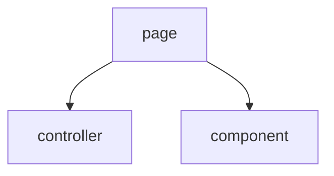
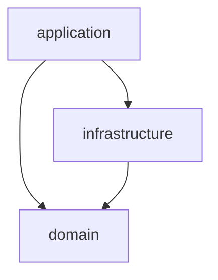
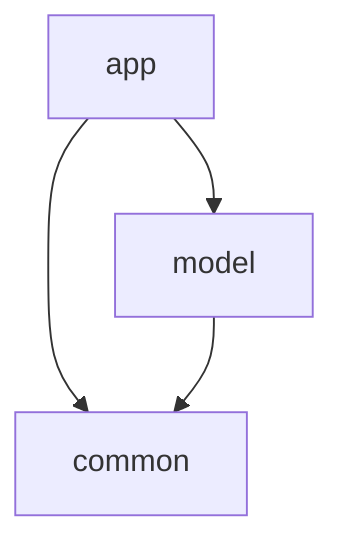

# アーキテクチャ 🏗️

## はじめに 📝

このドキュメントは、プロジェクトのソフトウェアアーキテクチャについて説明します。
[Philosophy](./philosophy.md) に基づいて設計されています。

## アーキテクチャの特徴 🌟

### 概要

主に DDD に影響を受けて設計しています。
次の本や記事が大きく影響を受けています：

- [ドメイン駆動設計 モデリング/実装ガイド](https://little-hands.booth.pm/items/1835632)
- [Flutterアプリにおける、過不足ない設計の考察🎅](https://medium.com/flutter-jp/architecture-240d3c56b597)
- [Omiai の Flutter プロジェクトのアーキテクチャ](https://zenn.dev/omiai_techblog/articles/omiai-flutter-architecture?redirected=1)
- [【Flutter】アプリ全体のアーキテクチャを0から考えて作り直した話](https://zenn.dev/chooyan/articles/eefc76dbd2ba25)
- [Flutter設計パターン入門](https://zenn.dev/flutteruniv/books/flutter-architecture)

### 重視すること

- シンプルである
- 影響範囲が最小限である
- 単体テストを書きやすい
- コードの重複を避ける

## マルチパッケージ構成 📦

本プロジェクトは、マルチパッケージ構成を採用しています。各パッケージの役割は以下の通りです：

### app パッケージ 📱

UI に関する実装を行います。
エントリーポイントとなる `main.dart` や各プラットフォーム特有のディレクトリを含みます。

`lib/` 配下のディレクトリ構造は以下の通りです：

- `core/`: アプリケーション全体で使用される基本的もしくは汎用的な機能を格納します。
  - `router/`: ルーティングに関する実装を行います。
  - `util/`: 共通のユーティリティ関数やヘルパークラスを格納します。
- `ui/`: ユーザーインターフェースに関連するコードを格納します。
  - `component/`: UI コンポーネントを格納します。関心事にディレクトリを分けています。
  - `controller/`: 画面単位のコントローラーを格納します。
  - `page/`: アプリケーションの各画面を表すウィジェットを格納します。
- `main.dart`

各ディレクトリの主な依存関係は以下の通りです：

### common パッケージ 🧰

共通のユーティリティと基本機能を提供します。
他のパッケージから参照されることを想定しています。

`lib/src` 配下のディレクトリ構造は以下の通りです：

- `{関心事}/`: 各関心事に対する実装を格納します。
- `util/`: 共通のユーティリティ機能を格納します。

### model パッケージ 📊

データモデル、ビジネスロジック、およびデータ操作に関する実装を行います。
アプリケーションのコアとなるロジックを含み、UI層から独立しています。

`lib/src` 配下のディレクトリ構造は以下の通りです：

- `feature/{関心事}`: 関心事ごとのモジュールを格納します。
  - `internal/`: 外部へ公開しないファイルを格納します。
  - `_{関心事}.dart`: 外部へ公開するファイルを export します。
- `util/`: ユーティリティ関数や共通のヘルパークラスを格納します。

各関心事 (feature) ディレクトリ内のファイルは以下のいずれかの層に該当します：
※ 必ずしもすべての層のファイルが存在するとは限りません
※ `_{関心事}.dart` と `util/` 配下は除きます

- `application 層`: アプリケーションロジック（ユースケース、サービス）を実装します。
- `domain 層`: ドメインオブジェクトを定義します。
- `infrastructure 層`: データソースの実装（リポジトリ、APIクライアントなど）を行います。

各層の依存関係は以下の通りです：

なお、上記の依存関係に従う場合、別の関心事のファイルを参照することを許容します。

## 依存関係 🔗

パッケージ間の依存関係は以下のようになっています：

## 状態管理 🔄

状態管理には Riverpod パッケージを使用します。
各プロバイダーの定義には、 Generator を使用します。

## ルーティング 🗺️

auto_route を使用してルーティングを管理しています。ルート定義は app パッケージの `app_router.dart` で行われています。
